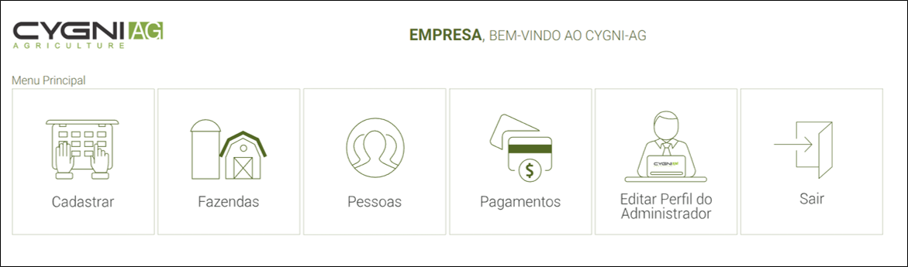

# Manual CYGNI-AG Empresas
>Plataforma Criada para Empresas de Insumos, Prestadoras de Serviços e Consultoria Agronômica

## Login

Após a CYGNI realizar o cadastro da empresa, você receberá um e-mail com os dados de acesso: nome de usuário e senha.
Clique em “Realizar Login”, você será redirecionado para a nossa página. 

Insira o nome de usuário, senha e clique em “entrar”. 

## Menu

<b>Cadastrar:</b> Cadastre fazendas ou pessoas, clicando no ícone correspondente.

<b>Fazendas:</b> Visualize as fazendas que você já cadastrou.

<b>Pessoas:</b> Visualize as pessoas cadastradas, tanto pelos seus clientes quanto pelos clientes deles (são os proprietários das fazendas, seus agrônomos, possível cliente, fornecedor, revendedor, funciona como uma agenda de contatos).

<b>Pagamentos:</b> Página onde você recebe, aprova ou rejeita solicitações de processamento de imagens das fazendas, visualiza a fatura completa referente ao mês, bem como realiza o pagamento pelo “Yapay” (site de confiança amplamente utilizado em pagamentos online).

<b>Editar perfil do administrador:</b> Local onde estão as informações do cadastro da empresa, você consegue edita-los quando quiser.

<b>Sair:</b> Você sai do sistema, para entrar de novo é necessário inserir novamente seu login, senha e clicar em “entrar”.

Clique no ícone desejado, e explore as opções!

## Senha e Perfil

Redefina sua senha clicando no ícone “Editar Perfil do Administrador”.

Clique em “Alterar Senha”.

Digite a senha atual e depois a nova senha, clique em “Salvar”.

Clique em "Ok", sua senha foi alterada!

## Cadastro de Fazenda

>O cadastro de fazenda no CYGNI AG serve para você ter uma visão panoramica das operações realizadas, talhões plantados, talhões não plantados, início/fim de colheita...e após o processamento das imagens você terá a visualização em RGB (a imagem semelhante à fotografia, sem aplicação de índices). Os índices serão analisados nos talhões, por isso não é obrigatório o cadastro de fazendas, você escolhe em cadastrar ou não.
No preço cobrado/ha, será considerado o tamaho total dos talhões, e não da fazenda.

Para cadastrá-la, siga os passos abaixo:

Clique no ícone que mostra o menu,  depois em “Cadastrar”.

Clique em “Fazendas”.

Preencha os campos das “Informações da Fazenda” e clique em “Próximo”.

### Contorno de Fazenda com o CYGNI AG

Na aba “Buscar”, digite a cidade mais próxima da sua fazenda, assim como o estado e o país, o mapa irá direcionar para a cidade.

Com o cursor do mouse navegue no mapa para encontrar sua fazenda.

Para demarcar uma fazenda, clique na aba “Demarcar Fazenda” <b>(1.1)</b> e clique em “ Demarcar contorno” <b>(1.2)</b>.
Com o cursor do mouse clique em toda delimitação da fazenda.
Você pode deletar os pontos do contorno que foram demarcados, clicando no ponto a ser excluído <b>(1.3)</b> e confirmar em “Remover”.
Você pode deletar o últimos pontos do contorno que foram demarcados em “Deletar ponto” <b>(1.3.1)</b> e pode também deletar o contorno completo em “Deletar contorno” <b>(1.3.2)</b>, que pede a confirmação para deletar.

Após terminar o desenho do contorno, clique em “Salvar” <b>(1.4)</b>.

### Contorno de Talhões com o CYGNI AG

Para demarcar talhões, clique em “Demarcar Talhões” <b>(2.1)</b>, "Demarcar contorno"<b>(2.2)</b> e realize o mesmo procedimento de demarcar fazenda.

!>Após desenhar nunca se esqueça de clicar em “Salvar” <b>(2.3)</b>, caso contrário você perderá o contorno.
Na lateral do mapa, um passo a passo para demarcar sua fazenda e talhões o ajudará.

### Importar Contornos (KML,SHP)

Se deseja importar o contorno da fazenda, clique na aba “Demarcar Fazenda” <b>(1.1)</b>, em seguida clique em “Importar” <b>(1.2)</b>.

Clique em “Escolher arquivo, uma janela dos arquivos do seu computador abrirá.

Selecione os arquivos em seu diretório de arquivos e clique em “Abrir” <b>(3)</b> (você pode selecionar todos de uma vez se quiser). 

Em seguida, clique em “Importar”.

Se deseja importar talhões, clique na aba “Demarcar Talhões” <b>(1.1)</b>, “Importar” <b>(1.2)</b> e seguir os mesmos passos de importar o contorno da fazenda.

## Nomear Talhões

Para nomear os talhões desenhados ou importados, clique na janela ao lado do mapa que contém as informações do talhão (nome, área e opções) e escreva o nome do talhão, exemplo: Talhão1 e Talhão2.

## Sede

Para demarcar a sede clique em “Sede” <b>(1.1)</b>, “Marcar” <b>(1.2)</b> e "Salvar" <b>(1.3)</b>.
No mapa clique no local da sede (um ícone representando a sede aparecerá).

Clique em “Próximo” para dar continuidade ao cadastro.

## Proprietário

É o momento de adicionar as informações sobre o proprietário da fazenda cadastrada:
Se você for o proprietário da fazenda: clique em “Sou proprietário” e “Salvar”.

Sua fazenda foi salva com sucesso! As informações que você inseriu corretamente, foram salvas.

Se não for o proprietário: clique em “Não sou proprietário” e cadastre-o clicando no botão "Cadastrar Proprietário"

Após preencher as informações do cadastro do proprietário, clique em “Salvar”.

Em caso de mais de um proprietário da fazenda, escolha qual é o principal proprietário, caso seja somente um, você também deve selecionar principal proprietário, clique em “Salvar”.

Sua fazenda foi salva com sucesso! As informações que você inseriu corretamente, foram salvas.

## Processamento de Imagens

>O processamento de imagens de satélite solicitado pelos clientes, aparecem no menu pagamentos automaticamente, porém as fazendas cadastradas pela própria empresa não aparecem, é necessário realizar uma busca, conforme o passo abaixo:

Clique no menu “Pagamentos”.

Na barra de busca “Solicitações de Processamento” digite o nome da fazenda que deseja ativar o processamento.
Clique em “Aprovar”.

Na palavra “contrato” em azul, leia-o, se estiver de acordo, clique em “Li e aceito os termos e condições do contrato” e em “Sim”. Se não estiver de acordo entre em contado com a CYGNI. 

Após ativar o processamento de imagens, o total processado e a fatura irão se atualizar de acordo com o processamento ativado <b>(1.1)</b>
Em “Histórico de Serviços” aparecerá o histórico das fazendas em que o processamento de imagens foi ativado <b>(1.2)</b>.
Para visualizar o cadastro e os mapas da fazenda, clique no ícone de atenção <b>(1.3)</b>.

Em “Histórico de Faturas” aparecerá as faturas por mês, clicando no ícone <b>(2.1)</b> você fará o download da fatura, clicando no ícone <b>(2.2)</b> ou em “Consultar” <b>(2.3)</b>, abrirá a janela do resumo da fatura por fazenda processada.

## Cadastro de Pessoa

Clique no menu “Cadastrar”.

Clique em “Pessoa”.

Preencha as informações do cadastro (dados pessoais, contato e endereço) de pessoa e clique em “Salvar”.

A pessoa foi salva com sucesso! Clique em “Ok”. 

As pessoas cadastradas ficarão listadas em “Pessoas Cadastradas”.

## Pagamento

Clique no menu “Pagamentos".

As informações de fatura estarão nesta tela, você pode consultar a fatura do mês atual clicando em "Consultar" e uma janela com a fatura abrirá.

Em "Histórico de Faturas" você consulta suas faturas passadas e a atual, assim como baixa, paga a fatura e consulta qual o Status de cada uma (Fatura em aberto, Pagar Fatura, Aguardando pagamento ou Pagamento atrasado).

!>Quando o pagamento estiver atrasado, entre em contato com a CYGNI.

São 3 opções de pagamentos previamente definidos entre a CYGNI e a empresa (será preenchida pela CYGNI).

A fatura será fechada 10 dias antes do vencimento.
O período da fatura é correspondente a 30 dias.

!>Lembre-se: A fatura é mensal, mas a sua assinatura é valida por um ano.

## Mudança de Contornos

>Quando for necessário modificar o contorno de talhões, será cobrada uma taxa proporcional aos dias após o processamento ativo e se houver aumento da área, será cobrada a diferença. Por exemplo: Cadastrei os talhões hoje, e modifico hoje, não terá cobrança de taxas adicionais, porém, se cadastrei a 10 dias atrás, o cálculo da “Taxa de edição” levará em conta 10 dias, pois, os talhões precisarão ser reprocessados, o que gera um custo.

## Imagens de Satélite

Clique em "Fazendas" para buscar a fazenda desejada.

Clique no mapa da fazenda desejada.

Você pode utilizar o filtro para auxiliar na busca, digite alguma das opções e clique em "Buscar".

>O nome da fazenda deve ser digitado exatamente como foi cadastrado, o Status você pode selecionar: Ativo (fazendas que você tem trabalhos ativos) ou Inativo (fazendas que você já fez algum trabalho mas, por um tempo não fará mais trabalhos), e processamento de imagens, filtrar por fazendas que estão com o processamendo de imagens ligado ou desligado.

Na aba "MAPA", as imagens de satélites serão listadas, role para baixo para visualizar todo o histórico:

Clique no botão para selecionar a imagem que você deseja visualizar: RGB miniatura, RGB, NDVI ou NDVI realçado.
A imagem aparecerá no mapa.
>A imagem RGB miniatura é ideal para pré visualizar uma imagem de uma forma mais rápida (carrega mais rápido), pois possui menor resolução e é ótima para identificar com rapidez se a imagem possui nuvem ou não.

A imagem abaixo ilusta um talhão sendo visualizado com o NDVI realçado.

>A quantidade de imagens de satélite disponível em cada fazenda, está relacionada com o lugar que a fazenda está localizada e como cada satélite capta as imagens. Abaixo, o "grid" dos satélites ilustra onde ele passa e fotografa.
Na aba "Satélites" clique em "Grid LandSat8" para visualizar o grid do satélite Landsat8 ou em "Grid Sentinel2" para visualizar o grid do satélite Sentinel.

## Filtros

Os filtros são excelentes para organizar suas imagens.

<b>Filtro satélites:</b> procure somente as imagens de Sentinel ou de Landsat. Em "todos" visualize todas as imagens dos satélites.

<b>Filtro imagens favoritas:</b> separe suas imagens favoritas clicando na estrela, ela ficará amarela quando você selecioná-la como favorita.

Para visualizar somente as imagens que são favoritas clique em "Sim". Para visualizar somente as imagens que não são favoritas clique em "Não". Para visualizar todas, clique em "Todos".

<b>Filtro de período:</b> Filtre o período que deseja consultar as imagens. Selecione a data inicial e a data final.

## Exportar KML dos Contornos

Você pode exportar para seu computador os contornos da fazenda e dos talhões que você desenhou ou exportou para o CYGNI AG.

Para exportar o contorno da fazenda, clique na aba fazenda, clique no botão opções e em "Baixar KML".

Para exportar o contorno de um talhão, clique na aba talhões, no botão "imagens".

Clique no botão "Opções" e "Exportar KML".

## Download de Imagens

Para realizar o download das imagens, selecione a imagem desejada clicando no quadrado na frente da imagem (conforme na imagem) ou todas as imagens em "Selecionar todas".

Clique no botão "Baixar".

Uma confirmação da quantidade de imagens a serem baixadas aparecerá na tela, verifique se está correta e clique em "Baixar".

O download das imagens será realizado em um arquivo ZIP.
As imagens disponíveis são nos formatos: json, tif e png.

!>Para trabalhar com as imagens em programas GIS, utilize a imagem no formato TIF. Para inserir em relatórios, utilize o formato PNG.

## Excluir Imagens 

Para excluir imagens que você não deseja mais visualizar na listagem (imagens que estão com 100% de cobertura de nuvens por exemplo), primeiro selecione-as.

Depois clique em "Deletar".

Para confirmar a ação, você deve digitar "deletar" no campo solicitado e clicar no botão "Deletar"

As imagens selecionadas para serem deletadas, foram deletadas!

## Modal Análises

>Nesta área você pode: analisar as estatísticas da imagem, demarcar pontos amostrais direcionados ao NDVI, gerar mapas de aplicação localizada, e pode também clarear uma imagem de satélite escura (algumas imagens em RGB podem aparecer escuras, mesmo livre de nuvens, pelo momento em que a imagem foi captada). 

Clique em "Análises" na imagem desejada.

Selecione a imagem RGB, clique no ícone de edição de imagens (assinalado em vermelho na imagem abaixo) e altere o brilho da imagem de acordo com a necessidade.

## Estatísticas

Para analizar a estística da imagem NDVI, selecione a imagem NDVI ou NDVI realçado.

!>A diferença entre o NDVI e o NDVI realçado é o realce dos pontos de atenção, os números são os mesmos.

O gráfico representa o número que cada cor representa no mapa e quantos hectares cada cor representa.
No exemplo abaixo, a cor amarela representa o número de NDVI: 0,55 em 51,2 hectares.

Clique em "Tabela" e visualize os valores de NDVI e hectares no formato de tabela.
Para sair da tabela, clique novamente em "Tabela".

Para saber o valor do NDVI em uma determinada área do mapa, coloque o cursor do mouse no mapa e verifique os valores nesta ferramenta de forma simultânea. 

>Área da imagem é o tamanho do talhão visualizado.
Valor máximo, médio, mínimo e desvio padrão são valores da imagem em NDVI e NDVI realçado.

Clique na ferramenta "Ponto" e clique na área do mapa que deseja verificar o valor do NDVI.

## Amostragem Direcionada

Direcione os pontos amostrais aos pontos de atenção do NDVI. Para demarcar, clique em "Marcar Ponto" e clique no mapa no local que deseja marcar o ponto amostral. Caso tenha demarcado um ponto em um local indesejado, clique em "Voltar Ponto". Caso queira deletar todos os pontos demarcados, clique em "Deletar Pontos".

Você pode modificar a cor dos pontos amostrais na ferramenta "Cor do Ponto", para um melhor destaque no mapa, escolha a cor desejada e clique em "Ok".

Você pode alterar o tamanho do ponto, clique em "Tamanho do Ponto" e modifique ao tamanho que desejar.

Para salvar os pontos amostrais demarcados, clique em "Salvar".

Nomeie os pontos amostrais e clique em "Salvar".

Para visualizar os pontos amostrais salvos, clique em "Carregar", e clique no ícone "Mostrar". Caso queira deletar os pontos que foram salvos, clique no ícone "Deletar".

## Mapas de Aplicação Localizada

Clique na aba "Aplicação" e clique em "Valor para amostra". 

Coloque a partir de qual valor de NDVI seu mapa deve ser gerado. 

Clique em "Gerar". Seu mapa de aplicação será ilustrado abaixo, caso queira modificar o valor, clique novamente em "Valor para amostra" e em "Gerar".

Para salvar o mapa de aplicação que foi gerado, clique em "Salvar".

Nomeie o arquivo em que o mapa de aplicação será salvo e clique em "Salvar".

Para visualizar o arquivo com o mapa de aplicação salvo, clique em "Carregar".

Clique no ícone "Mostrar" para visualizar o mapa de aplicação, e no ícone de "Deletar" para deletar o arquivo com o mapa de aplicação que foi salvo.

Para baixar o mapa de aplicação, clique em "Exportar".

Clique em "KML". O mapa de aplicação será baixado no formato KML.

!>O formato ideal para que as máquinas agrícolas façam a leitura do mapa de aplicação é o formato SHAPE, envie o arquivo no formato KML para o email: cygni@cygni.agr.br e nós faremos a transformação do formato do arquivo.

## Como Alterar o Responsável de uma Fazenda

>Esta função serve para passar uma fazenda que a empresa cadastrou, para o cadastro do cliente. Ou seja, uma fazenda cadastrada pela empresa pode ser visualizada pelo cliente.

No cadastro da fazenda, clique na aba "Geral", "Alterar responsável".

Escolha a pessoa que deseja colocar como responsável da fazenda, clique no nome dela e em "Alterar".

# Coleta de Amostras Nematológicas 

## Coleta
<ul>
	<li>Colete de 5 a 7 sub-amostras para aumentar a representatividade da sua amostra,</li>
	<li>Devem ser coletados solo e raiz, aproximadamente 500g de solo e 200g de raiz (radicelas e raízes grossas),</li>
	<li>Ao retirar cada planta, deve-se também retirar o solo que está ao redor das raízes,</li>
	<li>Utilize uma enxada para auxiliar no processo.</li>
</ul>

!>Nunca puxe a planta pela parte aérea, pois, tal procedimento leva ao rompimento e a perda de muitas raízes finas.

!>Colete as amostras com a umidade natural do solo, evitando condições de encharcamento ou ressecamento.

## Acondicionamento 

<ul>
	<li>Armazenar em recipientes limpos e sem resíduos tóxicos,</li>
	<li>Solo e raízes devem ser armazenados juntos, acondicionados em sacos plásticos resistentes bem fechados e devidamente identificados,</li>
	<li>Nunca deixe as amostras em ambiente aquecido pela exposição ao sol, pois o aquecimento e a incidência de luz pode prejudicar a conservação das amostras causando 	a morte dos nematoides.
	</li>
</ul>

!>Não armazenar em temperatura menor que 8°C pois pode causar danos.

!>Temperaturas de 10ºC a 15ºC prolongam a sobrevivência de nematoides nas amostras.

!>Amostras adequadamente embaladas podem ser armazenadas na geladeira em temperatura mais <b>elevada</b> por no máximo 4 dias.

## Identificação

Fichas e etiquetas devem acompanhar as amostras com o maior número de informações possível: 
<ul>
	<li>Número da amostra,</li>
	<li>Local (cidade, estado),</li>
	<li>Cultura e Variedade,</li>
	<li>Estágio de Desenvolvimento da Planta,</li>
	<li>Nome do coletor,</li> 
	<li>Data da coleta e outras informações relevantes,</li>
	<li>Evite molhar a etiqueta para não perder a identificação.</li>
</ul>

## Transporte

<ul>
<li>Devem ser encaminhadas ao Laboratório de Análises o mais rápido possível,</li>
<li>Queda e compressão das amostras podem ser prejudiciais a alguns gêneros de nematoides.</li>
</ul>

!>Caixas térmicas e/ou de isopor são indicadas para acondicionar as amostras durante o transporte ao laboratório.

## Condições Comerciais

<ul>
A análise nematológica inclui:
	<li>Análise de solo e raiz, envie <b>sempre</b> os dois materiais,
	<li>Quantificação e identificação de gênero,</li>
	<li>Identificação de espécies, inclusive <i>Meloydogine</i> por corte perineal e contagem de cistos quando encontrado <i>Heterodera</i> (<b>quando solicitado pelo cliente</b>),</li>
	<li>Contagem de cistos (no caso  da presença de <i>Heterodera glycines</i> nas amostras),</li>
	<li>O valor cobrado é de: <b>R$80,00</b> (oitenta reais),</li>	
	<li>A forma de pagamento pode ser: boleto com vencimento para 28 dias ou à vista,</li>	
	<li>O envio do resultado será por: e-mail e/ou correio.</li>
	</ul>

## Endereço

CYGNI AGRO CIÊNCIA - Laboratório de Nematologia.  
Rua: Avenida Perimetral, Número 2068. 
Bairro: Distrito Industrial II. 
Cidade: Pompeia-SP. 
CEP: 17580-000. 
Telefones: 55(14)3452-3226 , 55(14)3452-2553. 
